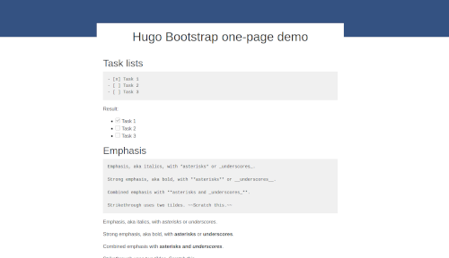

# Hugo Bootstrap one-page



[Check out the latest demo](https://hugo-bootstrap-demo.netlify.app/)

For people who want a **single page** static site with Bootstrap styling. No themes and extremely bare-bones.

Included is the ability to parse structured data from a file (json, yaml, or toml) into a table.

Ideal for landing pages, status pages, or general basic info.

## Get Started

Deploying on Netlify (free) is the easiest way to get started.

1. Fork this repository
1. Edit `config.yaml` to match your desired settings
1. Log in to Netlify
1. Choose "New site from Git" and follow their instructions

## Run locally

1. Install [Hugo](https://gohugo.io/getting-started/installing/)
1. Clone this repo and change to the new directory
1. Edit `config.yaml` to match your desired settings
1. Run: `hugo server`

## Component Overview

```
.
├── config.yaml            # Hugo configuration
├── content                
│   └── _index.md          # Main markdown file
├── data
│   └── apps.yaml          # Data file for parsing
└── layouts
    ├── index.html         # Main index.html file (site's root)
    └── shortcodes
        └── table.html     # Shortcode to make tables pretty
```

To effectively use this setup, start by looking at `layouts/index.html` and `content/_index.html`.

## Security Headers

If you add external sources of CSS, scripts, or media to this demo; know that the `Content-Security-Policy` header is set in the [`netlify.toml`](netlify.toml) file. [Click here](https://content-security-policy.com/) for more information about possible values.

Example configuration:

```
[[headers]]
  for = "/*"
  [headers.values]
  Content-Security-Policy = "default-src 'self'; style-src 'self' 'unsafe-inline' stackpath.bootstrapcdn.com; img-src 'self' https:;"
  X-Frame-Options = "DENY"
  X-Content-Type-Options = "nosniff"
  X-XSS-Protection = "1; mode=block"
```

## Disclaimer

This is not the proper way to use Hugo. Please read the documentation if you plan on using it for more than a single page site. Also, there's plenty of great starter themes available such as [docsy](https://www.docsy.dev/) or [Academic](https://themes.gohugo.io/academic/).

It is not recommended to have a giant monolith html file or to include CSS in that file.

_My entire goal was reducing the number of files and components while still gaining the super powers of markdown & Hugo._
